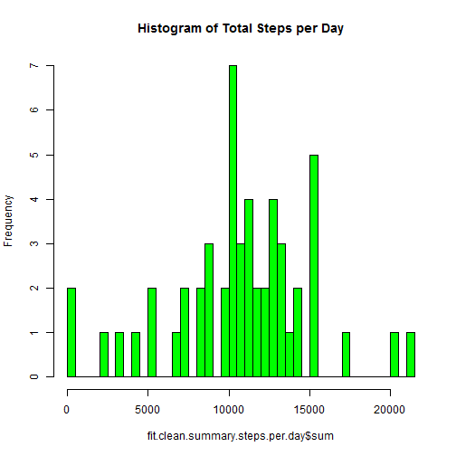
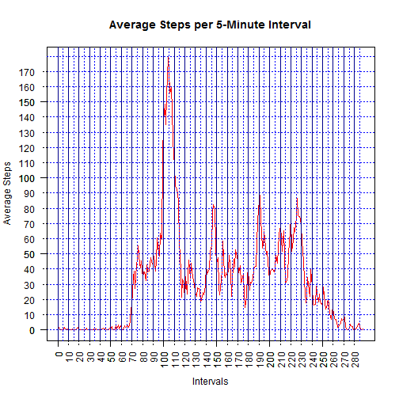
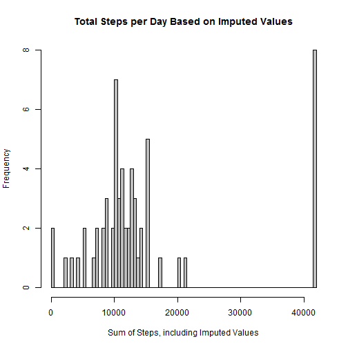
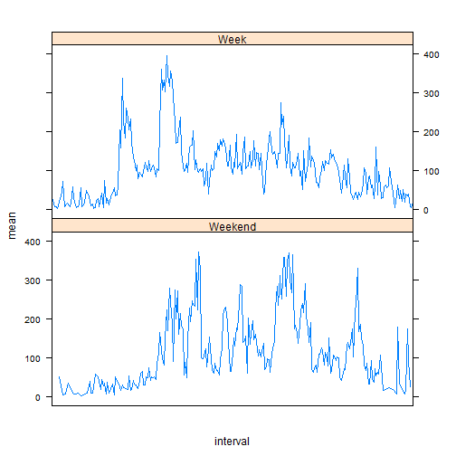

#### Task 1
1.1 Load the file and review the data structure:

```r
setwd("F:/_rdev/data-science-data/ds5")
fit <- read.csv("activity.csv")
str(fit)
```

```
## 'data.frame':	17568 obs. of  3 variables:
##  $ steps   : int  NA NA NA NA NA NA NA NA NA NA ...
##  $ date    : Factor w/ 61 levels "2012-10-01","2012-10-02",..: 1 1 1 1 1 1 1 1 1 1 ...
##  $ interval: int  0 5 10 15 20 25 30 35 40 45 ...
```

1.2 Process/transform the data (if necessary) into a format suitable for your analysis


```r
#Prepare for analysis by processing the records:  
#* Add a 'day of week' variable  
#* Add a variable identifying the record as weekday or weekend  
#* Re-assign factors as appropriate  

# add day of week variables
fit$dayofweek <- as.factor(weekdays(as.POSIXlt(fit$date)))

# add weekend variable 
fit$isweekend[fit$dayofweek == "Saturday"] <- "Weekend"
fit$isweekend[fit$dayofweek == "Sunday"] <- "Weekend"
fit$isweekend[is.na(fit$isweekend)] <- "Week"
fit$isweekend <- as.factor(fit$isweekend)
 
fit$interval <- as.factor(fit$interval) # preparing factors
fit$date <- as.factor(fit$date) # review changes to structure

str(fit)
```

```
## 'data.frame':	17568 obs. of  5 variables:
##  $ steps    : int  NA NA NA NA NA NA NA NA NA NA ...
##  $ date     : Factor w/ 61 levels "2012-10-01","2012-10-02",..: 1 1 1 1 1 1 1 1 1 1 ...
##  $ interval : Factor w/ 288 levels "0","5","10","15",..: 1 2 3 4 5 6 7 8 9 10 ...
##  $ dayofweek: Factor w/ 7 levels "Friday","Monday",..: 2 2 2 2 2 2 2 2 2 2 ...
##  $ isweekend: Factor w/ 2 levels "Week","Weekend": 1 1 1 1 1 1 1 1 1 1 ...
```

#### Task 2

2.1 What is mean total number of steps taken per day?  
* For this part of the assignment, you can ignore the missing values in the dataset.  

2.2 Calculate the total number of steps taken per day  

```r
# remove missing values
fit.clean <- fit[ which(!is.na(fit$steps) & fit$steps != 0), ]
str(fit.clean) 
```

```
## 'data.frame':	4250 obs. of  5 variables:
##  $ steps    : int  117 9 4 36 25 90 411 413 415 519 ...
##  $ date     : Factor w/ 61 levels "2012-10-01","2012-10-02",..: 2 2 3 3 3 3 3 3 3 3 ...
##  $ interval : Factor w/ 288 levels "0","5","10","15",..: 267 268 51 55 68 71 72 73 74 75 ...
##  $ dayofweek: Factor w/ 7 levels "Friday","Monday",..: 6 6 7 7 7 7 7 7 7 7 ...
##  $ isweekend: Factor w/ 2 levels "Week","Weekend": 1 1 1 1 1 1 1 1 1 1 ...
```

```r
library(plyr)
fit.clean.summary.steps.per.day <- data.frame()
fit.clean.summary.steps.per.day <- ddply(fit.clean, .(date), summarise, mean=mean(steps), median=median(steps), sum=sum(steps))
str(fit.clean.summary.steps.per.day)
```

```
## 'data.frame':	53 obs. of  4 variables:
##  $ date  : Factor w/ 61 levels "2012-10-01","2012-10-02",..: 2 3 4 5 6 7 9 10 11 12 ...
##  $ mean  : num  63 140 121 155 145 ...
##  $ median: num  63 61 56.5 66 67 52.5 48 56.5 35 46 ...
##  $ sum   : int  126 11352 12116 13294 15420 11015 12811 9900 10304 17382 ...
```

2.3 Make a histogram of the total number of steps taken each day  

```r
# Answer 1.2 Make a histogram of the total number of steps taken each day
hist(fit.clean.summary.steps.per.day$sum,breaks=53,main="Histogram of Total Steps per Day",col="green")
```

 

2.4 Calculate and report the mean and median of the total number of steps taken per day

```r
print(fit.clean.summary.steps.per.day)
```

```
##          date      mean median   sum
## 1  2012-10-02  63.00000   63.0   126
## 2  2012-10-03 140.14815   61.0 11352
## 3  2012-10-04 121.16000   56.5 12116
## 4  2012-10-05 154.58140   66.0 13294
## 5  2012-10-06 145.47170   67.0 15420
## 6  2012-10-07 101.99074   52.5 11015
## 7  2012-10-09 134.85263   48.0 12811
## 8  2012-10-10  95.19231   56.5  9900
## 9  2012-10-11 137.38667   35.0 10304
## 10 2012-10-12 156.59459   46.0 17382
## 11 2012-10-13 119.48077   45.5 12426
## 12 2012-10-14 160.61702   60.5 15098
## 13 2012-10-15 131.67532   54.0 10139
## 14 2012-10-16 157.12500   64.0 15084
## 15 2012-10-17 152.86364   61.5 13452
## 16 2012-10-18 152.36364   52.5 10056
## 17 2012-10-19 127.19355   74.0 11829
## 18 2012-10-20 125.24096   49.0 10395
## 19 2012-10-21  96.93407   48.0  8821
## 20 2012-10-22 154.71264   52.0 13460
## 21 2012-10-23 101.34091   56.0  8918
## 22 2012-10-24 104.43750   51.5  8355
## 23 2012-10-25  56.63636   35.0  2492
## 24 2012-10-26  77.02273   36.5  6778
## 25 2012-10-27 134.92000   72.0 10119
## 26 2012-10-28 110.17308   61.0 11458
## 27 2012-10-29  80.93548   54.5  5018
## 28 2012-10-30 110.32584   40.0  9819
## 29 2012-10-31 179.23256   83.5 15414
## 30 2012-11-02 143.24324   55.5 10600
## 31 2012-11-03 117.45556   59.0 10571
## 32 2012-11-05 141.06757   66.0 10439
## 33 2012-11-06 100.40964   52.0  8334
## 34 2012-11-07 135.61053   58.0 12883
## 35 2012-11-08  61.90385   42.5  3219
## 36 2012-11-11 132.71579   55.0 12608
## 37 2012-11-12 156.01449   42.0 10765
## 38 2012-11-13  90.56790   57.0  7336
## 39 2012-11-15  20.50000   20.5    41
## 40 2012-11-16  89.19672   43.0  5441
## 41 2012-11-17 183.83333   65.5 14339
## 42 2012-11-18 162.47312   80.0 15110
## 43 2012-11-19 117.88000   34.0  8841
## 44 2012-11-20  95.14894   58.0  4472
## 45 2012-11-21 188.04412   55.0 12787
## 46 2012-11-22 177.62609   65.0 20427
## 47 2012-11-23 252.30952  113.0 21194
## 48 2012-11-24 176.56098   65.5 14478
## 49 2012-11-25 140.88095   84.0 11834
## 50 2012-11-26 128.29885   53.0 11162
## 51 2012-11-27 158.67442   57.0 13646
## 52 2012-11-28 212.14583   70.0 10183
## 53 2012-11-29 110.10938   44.5  7047
```
#### Task 3

3.1 What is the average daily activity pattern?  

* Make a time series plot (i.e. type = "l") of the 5-minute interval (x-axis) and 
* the average number of steps taken, averaged across all days (y-axis)

3.2 Which 5-minute interval, on average across all the days in the dataset, contains the maximum number of steps?


```r
fit$steps.nona <- fit$steps # calculating mean will require 0 instead of NA values
fit$steps.nona[is.na(fit$steps)] <- 0
fit.sum.mean.interv <- ddply(fit,.(interval),summarise,mean=mean(steps.nona))
str(fit.sum.mean.interv)
```

```
## 'data.frame':	288 obs. of  2 variables:
##  $ interval: Factor w/ 288 levels "0","5","10","15",..: 1 2 3 4 5 6 7 8 9 10 ...
##  $ mean    : num  1.4918 0.2951 0.1148 0.1311 0.0656 ...
```

```r
plot(fit.sum.mean.interv$mean, type="l", main="Average Steps per 5-Minute Interval", xlab="Intervals", ylab="Average Steps", las=2, col="red")
abline(h=c(seq(from=0, to=1000, by=10)), lty=3, col="blue")
abline(v=c(seq(from=0, to=288, by=5)), lty=3, col="blue")
abline(v=c(seq(from=0, to=288, by=10)), lty=1, col="dark blue")
axis(side = 1, at=c(seq(from=0,to=288,by=10)),las=2, lty=3)
axis(side = 2, at=c(seq(from=0,to=max(fit.sum.mean.interv$mean),by=10)),las=2, lty=3)
```

 

Answers

3.1 Based on averages of the steps taken per 5-minute intervals across all 61 days, the activity pattern:  

* Interval 0 - 70: nearly zero movement from midnight to 5:50AM 
* Interval 71 -105: gradual rise  from 5:50AM to 8:30AM
* Interval 105: Sharp, distinct peak  at 8:50AM
* Interval 106 - 116: sharp decline  
* Interval 130 - 230: three successive minor peaks  
* Interval 230 -288: steady decline to 0 steps  

3.2 Interval 115 displays the maximum steps across all intervals. 


#### Task 4  

Imputing missing values  
* Note that there are a number of days/intervals where there are missing values (coded as NA).  
* The presence of missing days may introduce bias into some calculations or summaries of the data.

4.1 Calculate and report the total number of missing values in the dataset (i.e. the total number of rows with NAs)

```r
vec <- c()
vec <- fit$steps
# Answer 4.1 Calculate and report the total number of missing values in the dataset = 2,304
print(length(vec[is.na(vec)]))
```

```
## [1] 2304
```

4.2 Devise a strategy for filling in all of the missing values in the dataset.  
* The strategy does not need to be sophisticated.  
* For example, you could use the mean/median for that day, or the mean for that 5-minute interval, etc.

Answer 4.2  
Selected Strategy:  Mean of interval across all days will be assigned as imputed steps for intervals the have NA values


4.3 Create a new dataset that is equal to the original dataset but with the missing data filled in.

```r
# Answer 4.3
fit.imp <- fit # duplicate original dataset
fit.imp$imp.steps <- as.numeric(0) # create field to store imputed steps

get.intv.mean <- function(x){
        the.value <- match(x,fit.sum.mean.interv$interval,nomatch=0,incomparables=NULL)
        return(the.value)
}
fit.imp$imp.steps <- fit.imp$steps # fill $imp.steps field with $steps value
fit.imp$imp.steps[is.na(fit.imp$imp.steps)] <- get.intv.mean(fit.imp$interval) # replace NA values with function
```

```
## Warning in fit.imp$imp.steps[is.na(fit.imp$imp.steps)] <-
## get.intv.mean(fit.imp$interval): number of items to replace is not a
## multiple of replacement length
```

```r
summary(fit.imp$steps) # review original unchaged values
```

```
##    Min. 1st Qu.  Median    Mean 3rd Qu.    Max.    NA's 
##    0.00    0.00    0.00   37.38   12.00  806.00    2304
```

```r
summary(fit.imp$imp.steps) # review changes applied
```

```
##    Min. 1st Qu.  Median    Mean 3rd Qu.    Max. 
##    0.00    0.00    0.00   51.43   44.00  806.00
```

4.4 Make a histogram of the total number of steps taken each day and Calculate and report the mean and median total number of steps taken per day. 

```r
# Answer 4.4
fit.sum.imp <- ddply(fit.imp,.(date),summarise,mean=mean(imp.steps),median=median(imp.steps),sum=sum(imp.steps))
hist(fit.sum.imp$sum,breaks=61,xlab="Sum of Steps, including Imputed Values",main="Total Steps per Day Based on Imputed Values",col="gray")
```

 

4.5 Do these values differ from the estimates from the first part of the assignment?   
* Answer 4.5  
* These values absolutely differ from the original un-imputed set of values.

4.6 What is the impact of imputing missing data on the estimates of the total daily number of steps?  
* Answer 4.6  
* Imputing based on mean steps per interval across ALL observed days adds a massive number of steps; from 20,000 max to more than 40,000 max. I'd revise this approach to imputing based on a 5th percentile of steps taken per interval across all observed days.

#### Task 5
   
5.1 Are there differences in activity patterns between weekdays and weekends?  

+ For this part the weekdays() function may be of some help here. Use the dataset with the filled-in missing values for this part.  

+ Create a new factor variable in the dataset with two levels -- "weekday" and "weekend" indicating whether a given date is a weekday or weekend day.  

Answer 5.1  
* Done above, in pre-processing.  
* See Task 1, Element 1.2.


5.2 Make a panel plot containing a time series plot (i.e. type = "l") of the 5-minute interval (x-axis) and the average number of steps taken, averaged across all weekday days or weekend days (y-axis). The plot should look something like the following, which was created using simulated data:

```r
# Answer 5.2
fit.cln.weekend <- fit.clean[which(fit.clean$isweekend=="Weekend"),]
fit.cln.week <- fit.clean[which(fit.clean$isweekend=="Week"),]

fit.cln.wknd.mean.steps.per.intv <- ddply(fit.cln.weekend,.(interval),summarise,mean=mean(steps))
fit.cln.week.mean.steps.per.intv <- ddply(fit.cln.week,.(interval),summarise,mean=mean(steps))

fit.cln.wknd.mean.steps.per.intv$typeofday <- as.factor("Weekend")
fit.cln.week.mean.steps.per.intv$typeofday <- as.factor("Week")
testrbind <- rbind(fit.cln.wknd.mean.steps.per.intv,fit.cln.week.mean.steps.per.intv)

library(lattice)
xyplot(mean~interval|typeofday,data=testrbind,type="l",layout=c(1,2), scales=list(x=list(at=seq(0,2000,500))))
```

 

```r
# xyplot(mean~interval|typeofday,data=testrbind,type="l",
#        xlab="Interval",ylab="Mean Steps",as.table=TRUE,
#       layout=c(1,2),scales=list(x=list(at=seq(0,2000,500))))
```
